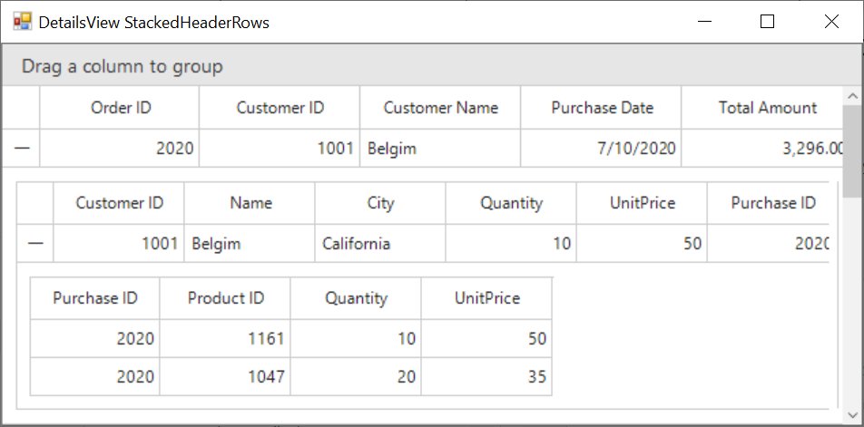

# how-to-generate-the-two-level-detailsviewdatagrid-with-datatable-collection-in-winforms-datagrid

## About the sample
This example illustrates how to generate the two level DetailsViewDataGrid with DataTable collection in WinForms DataGrid(SfDataGrid).

By default, the DetailsView will be added for single relation when the AutoGenerateRelations is enabled. To add multiple related tables in SfDataGrid, AutoGenerateRelations for each grid can be enabled through SfDataGrid.AutoGeneratingRelations event.

```C#
//Event subscription
this.sfDataGrid1.AutoGeneratingRelations += new Syncfusion.WinForms.DataGrid.Events.AutoGeneratingRelationsEventHandler(SfDataGrid1_AutoGeneratingRelations);

//Event customization
private void SfDataGrid1_AutoGeneratingRelations(object sender, Syncfusion.WinForms.DataGrid.Events.AutoGeneratingRelationsEventArgs e)
{
    //To enable AutoGenerateColumns for child grid.
    e.GridViewDefinition.DataGrid.AutoGenerateRelations = true;
}
```

## Requirements to run the demo
Visual Studio 2015 and above versions


