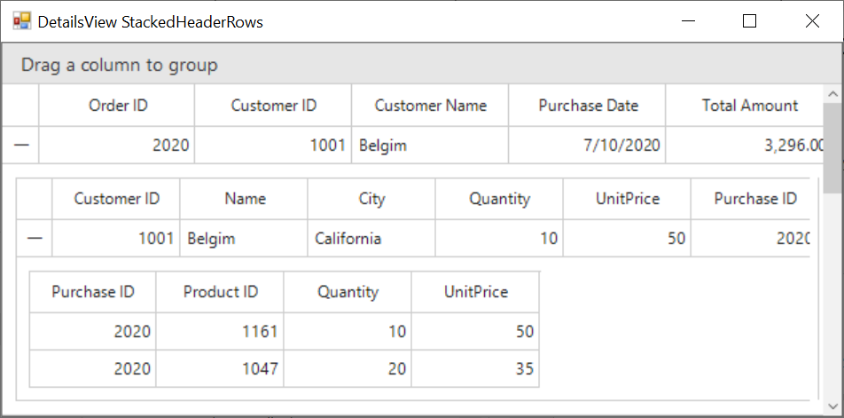

# How to Generate the Two Level DetailsViewDataGrid with DataTable Collection in WinForms DataGrid?

This sample illustrates how to generate the two level `DetailsViewDataGrid` with `DataTable` collection in [WinForms DataGrid](https://www.syncfusion.com/winforms-ui-controls/datagrid) (SfDataGrid).

By default, the `DetailsView` will be added for single relation when the `AutoGenerateRelations` is enabled. To add multiple related tables in `DataGrid`, `AutoGenerateRelations` for each grid can be enabled through [SfDataGrid.AutoGeneratingRelations](https://help.syncfusion.com/cr/windowsforms/Syncfusion.WinForms.DataGrid.SfDataGrid.html#Syncfusion_WinForms_DataGrid_SfDataGrid_AutoGeneratingRelations) event.

``` csharp
//Event subscription
this.sfDataGrid1.AutoGeneratingRelations += new Syncfusion.WinForms.DataGrid.Events.AutoGeneratingRelationsEventHandler(SfDataGrid1_AutoGeneratingRelations);
 
//Event customization
private void SfDataGrid1_AutoGeneratingRelations(object sender, Syncfusion.WinForms.DataGrid.Events.AutoGeneratingRelationsEventArgs e)
{
    //To enable AutoGenerateColumns for child grid.
    e.GridViewDefinition.DataGrid.AutoGenerateRelations = true;
}
```


